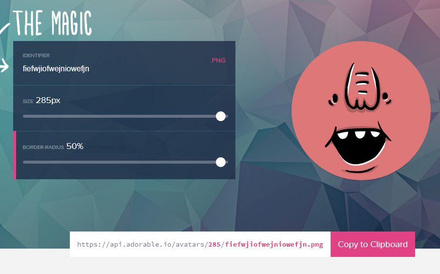
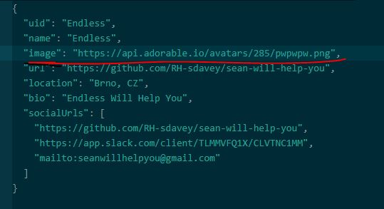
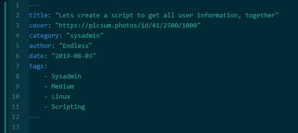

## So How I can help?

First of all, thanks, any help is massively appreciated. I cant pay in cash really ( I *could* talk about that but absolutely no guarantees )
I am open to discussion about payments if you can guarantee a regular contribution... but Im hoping you wont consider cash as the main incentive here.

## So Why should I help?

Well first of all, 
- just because its nice. Nice to help me, nice to help people who need help online. It just feels nice. Its nice to feel nice.
- It will look pretty freaking cool on your CV that youre a "regular contributor" or "content-creator" for an open-source Linux tutorial website, teaching others how to learn sysadmin/developer/devops/scrum skills. I will add you to a contributors list both on the site and here on GH, so you have proof of your contributions.
- Your github heatmap will be green for everyday you provide some content. As I learned recently, potential employers are checking this github heatmap to see how active you are with Git, THIS is probably the best chance to have an easy all-green couple of months. If you contribute just a few commits per week, you will be pretttyyy greeennn.
- Because its super easy... the tutorials are written in Markdown, which is the easiest f***ing "language" in the world. I can write a tutorial in ~45 minutes.
- All the hard works already done. Ive created the site, Ive setup the CI, the framework, the javascript, frontend etc. Now all I need is the easy stuff. Content! I can even provide you sites to "take inspiration from"
- Imagine if your colleague asks you to help him with something, and you already know the tutorial how to do it is on OUR website. That will feel pretty good.
- You might learn something from the very site you are contributing to! 

## Ok Ok, shut up , lets get started!

First of all, you need to create an "author" profile 
(if not, the default "Sean" author (not me, the 'website Sean', my username is "Endless") will be used)

The easiest way to do that is to copy and paste an existing profile and change the details.
existing profiles are found here....
sean-will-help-you/content/sean-authors/authors

remember to make the uid EXACTLY the same as the name of the author profile.json file you create

only part that requires any extra work here is to create an avatar... go to the website [here](https://api.adorable.io/) and scroll to the bottom, enter ANY text in the
"identifier" box select the largest size, and 50% radius, then copy the link provided to the "image" field in your author profile

Change the "url" and "socialUrls" boxes to your own if you wish, or leave them as the swhy defaults.

## I am an author, lets write content!

Perfect, so, next we need some content, if you have some ideas, then great lets get started, if you have no ideas or want some easy start to figure out how to get started, 
(shhhh...."borrow" something from these sites)  
<a href="https://opensource.com/tags/linux">opensource</a> 
        <a href="https://linuxjourney.com/">linuxjourney</a> 
        <a href="https://ryanstutorials.net/linuxtutorial/">ryanstutorials</a> 
        <a href="https://www.cyberciti.biz/faq/">GREAT PLACE TO COPY FROM</a> 
        <a href="https://wiki.bash-hackers.org/start">bash-hackers</a> 
        <a href="https://devhints.io/">devhints</a> 
        <a href="https://vim.fandom.com/wiki/Vim_Tips_Wiki/">vim hints</a> 
        
### How to write content?

Well the tutorials are written in Markdown. Heres everything you need to know about Markdown....  
[markdown cheatsheet](https://github.com/adam-p/markdown-here/wiki/Markdown-Cheatsheet) 
[markdown emojis](https://gist.github.com/rxaviers/7360908)  <--- copy and paste the actual emoji to your text... dont use the "code"

This exact text you are reading is written in markdown, and so are the tutorials on the site I already made. Check out whats possible.

I would ask you please to try to keep every tutorial to the same basic outline... 

introduction ->

what we want to achieve ->

prerequisites ->

tutorial ->

explanation ->

what did we learn ->

end text

end text should be:
"If Sean Helped You today, feel free to share this post or connect with us soon, available via [gmail](mailto:seanwillhelpyou@gmail.com), [slack](https://app.slack.com/client/TLMMVFQ1X/CLVTNC1MM) or [github](https://github.com/RH-sdavey/sean-will-help-you).
Thanks for reading!"      <----- See the source code of an existing tutorial for the code for the end_text

Ive tried to keep the style friendly and "like a conversation" with the visitor voice written in header 2 "##" and the site voice written in normal text ( exactly like the document you are reading now )  
I think if you are writing an "easy" tutorial for beginners, then provide slightly more help... hold the users hand and explain as much as possible to stop confusion, but if you are creating an expert tutorial, dont hold the users hand, just give them facts and figures, commands and data, thats it (but make sure the commands will work!)

Every tutorial has a "header" that is parsed by some backend script and helps create some components of the website, lets look at the header...

- First line is the title displayed on the list of tutorials and tutorial page when its opened
- cover: url comes from the website shown : "picsum.photos" you can choose any picture there, they are all open source and free to use, but please use the size /2500/100 ( see example above ) (there is a cool trick to either have the same pic every time, or to update the picture every time the tutorial page is refreshed, ask me if you cant figure it out from my examples, tip: check out the welcome page in "content/sean-posts/2999-10-19" for a clue ;) )
- choose a category "sysadmin "developer" "devops" or "scrummaster"
- author: make this EXACTLY the same to the uid of your author profile
- date: make this IDENTICAL to the folder that your tutorial is in. Be aware that the order of the dates in these folders determines the order of the tutorials on the site. Thats why there is one tutorial in year 2999 that will always be top of the list. Its not possible to have two tutorials on the same day, I dont think this is a problem.
- tags : a list of tags, please copy an existing example. This will be displayed on the site, and users can click on the these tags to find similar posts. For example if you tag post with "Vim" or "easy", then users can click on those tags and see other "Vim" or "Easy Tutorials". Please have at least always a "easy" "medium" "hard" or "expert" tag.
 all headers are surrounded with three "---" at the top and bottom, (see example above)
 
 ## How can I add pictures and screenshots?
 
 take a snip of the screenshot, generally you can make it as large as you wish, as the page will automatically resize images to a standard size. anyway if youre using a decent IDE you can preview the images you add.
 See already existing tutorials code for how to implement screenshots into your tutorials, I have a few examples ( including this document you are readng now ) 
 
 A lot of cool pictures that can break up the text a little can be found [here](https://picsum.photos/images) See my tutorial examples of how to embed pictures from this site.
 
 ## and those "tip" boxes?
 
 If you want to create a "tip" or "hint" for the user to do something in a quicker/more efficient or better way, or a keyboard shortcut to do something then put it inside a "blockquote" 
> 👍 Like this 
 
 ( see the markdown cheatsheet) and copy the thumbsup emoji (the actual emoji, not the code) as the first thing inside the blockquote... and then your tip
 
 
 
 ## Right, so I have an author, I can create posts, how can I get them to you Sean?
 
 well its a simple workflow to be honest, you should
 - fork or clone this repo. (ask me directly if you dont know how) 
 - create a branch
 - make your changes or tutorial content
 - create commit with reasonable commit message explaining your changes
 - push to your upstream branch (github) 
 - create a Pull request from your branch to my master
 - assign me to the Pull Request if not done by default
 - I will review it/check for English/formatting/suggestions etc and if all netlify and my checks are green, I will merge it to master
 - it then goes through a "publishing check" in netlify and if all passes in the CI, 
 - you will see the changes in ~2 minutes on the website [swhy](https://swhy.netlify.com)
 - Happy days. If you need any help, contact me directly, or in the slack room. No problem.
 
 Im cloning the repo and editing in Atom ( and trying out 'Visual Studio Code' ) just FYI.

## I dont want to help with content, but I have some ideas or some bug I found....

OK, no worries about not wanting to help, I understand you are busy, dont have time, want to relax away from your computers. no stress from me and no problem.
If you have some ideas or bug you found, please submit an "issue" on this repo, ( "Issues" tab above ) and write me an issue, please assign me, and also please assign the "sean-will-help-you" project,
This will automatically create a ticket on my project board, which you can see by clicking on "Projects" tab above, actually this projects tab is maybe a better way of creating tasks for me to do, as I check that more often than the issues.

## I wont do any of this, I dont want to help

No problem! have a nice day, if you think of any else who may want to help, please show them the site/this file or the [request-for-help-site](https://gracious-bell-9a0cdc.netlify.com/) and maybe they can help. Id really like this site to be popular, and it really depends on the amount of content to begin with so any help is appreciated.

### Thanks for reading if you got this far! I'm looking forward to any collaboration with you!

Subjects I need for tutorials....
- anything IT! linux / bash / vim / jenkins / networking / ansible / docker / java / sed / awk / scripting / command line tips and tricks / python / groovy / make files / maven / middleware / ethical hacking / network admin / rhcsa / rhce / windows / chrome extensions / keyboard shortcuts / IDE tips / C, C#, C++  / SQL / Jira / Markdown / Kubernetes / Cockpit / PowerShell / GIT / JavaScript / HTML / CSS
- Literally anything IT that you know, and you think could be useful for somebody else. Even if you just search Stackoverflow for the most common questions and make a tutorial for that subject, it would help a lot!

Thanks again, have a great day!
If you need help, remember, Sean will help you!  ( so get in touch ) 
