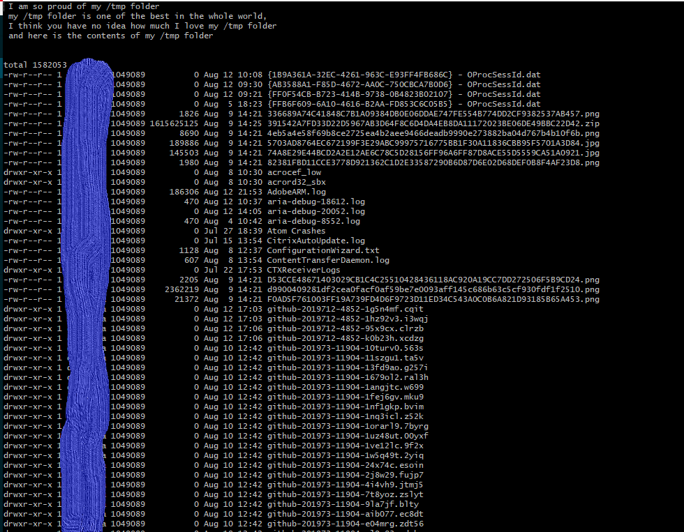
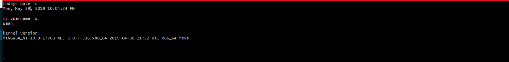
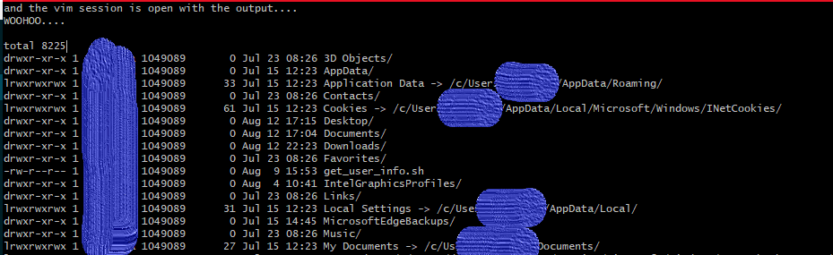

## How can I add the output of a shell command to my current file open in Vim?

Check it out, you're in Vim, you're working on your file, and then... you need the output of some command... something like this...

> and here is the contents of my /tmp folder ...

well, now what? you have to save and exit Vim, and probably most of you will do something like this...

```
ls -l /tmp >> myfile
```
right? WELL NOOOO MOOOOREEEE

here we go... while you are still in Vim, try this...
enter "escape mode" by pressing `esc` key and type:
```
:r! ls -l /tmp
```

and.... the contents of your /tmp directory are automatically entered into your directory. oooooooooh sploosh.



### dont give no damn about contents of the tmp folder, what about something else...

ok ....

what about this, open a new Vim file and try This

```
Press "i" for insert mode
type: Todays date is <esc> :r! date
<i><enter>
type: my username is <esc> :r! whoami
<i><enter>
type: kernel version is <esc> :r! uname -a
```

without leaving Vim, the output of the `:r!` shell commands should produce something like this...



and thats it!,

> 👍  One small tip, you can also forward the output of a shell command directly to a vim session from the command line... lets look how quickly...
>
> Surely you all know how to pipe the output of a command to a file...
>
> ls -l ~ | my_file
>
> Easy,
> but then you have to open that file in Vim to add anything to it... no longer!
>
> ls -l ~ | vim -
>
> a viola! a new vim session open with the output of your command already inserted to the file...
> 
>
> 


Today we learned **two** ways to forward the output of a shell command directly to a vim session without needing to switch between bash and Vim...like a boss!

If Sean Helped You today, feel free to share this post or connect with us soon, available via [gmail](mailto:seanwillhelpyou@gmail.com), [slack](https://app.slack.com/client/TLMMVFQ1X/CLVTNC1MM) or [github](https://github.com/RH-sdavey/sean-will-help-you).
Thanks for reading!
