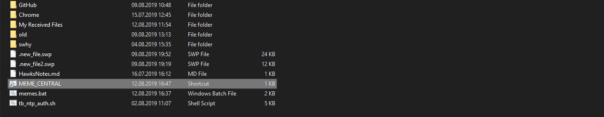

## If you regularly need to open the same windows in Google Chrome, follow this tutorial to learn how to automate that

This Tutorial is for Windows, (Linux will be later) and will show you how to automate opening the same tabs in Google Chrome at the press of a few keys on your keyboard.

First of all, open `notepad` in MS Windows, we will create a `.bat` script which is a script able to be run in Windows.

On the first line of the file type,
```
@echo off
```
This will stop the "loading" of our script and background code being shown (it just looks messy so we turn it off here)

next line should be

```bash
start "" "C:\Program Files (x86)\Google\Chrome\Application\chrome.exe" "--start-maximized --incognito <website here>"
```
lets break it down,
- start = "start a new process/program"
- "" = with no extra environment variables
- "C:\Program Files (x86)\Google\Chrome\Application\chrome.exe" = chrome application, (you could use IE or Firefox also, all you need is the full path to that on your system)
- "--start-maximized --incognito"  = start Chrome maximized and in incognito mode ( these are optional )
- \<website= here\>  = a website you wish to open (eg:  https://reddit.com https://google.com https://stackoverflow.com)

> 👍 because of some issues with google searches and some websites not opening correctly, I would recommend to copy and paste the whole line and replace the website for each site you want to open, its not the most efficient way, but seems to solve a lot of problems. They should all open in the same Chrome window. See the example below if needed.

and that's it! Now in Notepad, choose File>Save as..

and save the file somewhere ( for eg: your Documents Folder ) as a `bat` file ... for example, `memes.bat`

Your `memes.bat` script should look similar to this...


```bash
@echo off
start "" "C:\Program Files (x86)\Google\Chrome\Application\chrome.exe" "--start-maximized --incognito https://www.google.com/search?q=scottish+memes"  
start "" "C:\Program Files (x86)\Google\Chrome\Application\chrome.exe" "--start-maximized --incognito https://www.google.com/search?q=funny+memes/"   
start "" "C:\Program Files (x86)\Google\Chrome\Application\chrome.exe" "--start-maximized --incognito https://www.reddit.com/r/memes/"  
start "" "C:\Program Files (x86)\Google\Chrome\Application\chrome.exe" "--start-maximized --incognito https://imgur.com/gallery/1zpe1/"  
start "" "C:\Program Files (x86)\Google\Chrome\Application\chrome.exe" "--start-maximized --incognito https://www.reddit.com/r/dankmemes/"
```

Now you can double-click this bat file, to execute it, and this is what you should see...


Niiiiiiice.....

## But you promised it would work after a keyboard button is pressed...

I did, you're right. So lets make it happen...

First of all its important to know, `.bat` files aren't trusted by default in Windows, that's because it is possible to write some pretty nasty code in a `.bat` file, make it look like a nice, helpful script and pass it around freely. For that reason, Windows chooses not to trust `.bat` files by default.

### Is there a way to make windows trust *my* .bat file?

Yes! easily.  All you do is right click your `.bat` file and select "create shortcut", Windows absolutely trusts shortcut files!

Now rename the shortcut to some unique name, I will rename mine to `MEME_CENTRAL`



now right click your newly renamed file and click "Properties", from the window that appears, you can change the icon of the "application" you just created ( in the "Change Icon" button ), and also in the "Run:" option, choose "Minimized" to not show any terminal window showing your script running, (it will still show Chrome, don't worry)


and press "OK"

## Are we there yet?

Almost done...
So now you can just press your windows key on your laptop, or your start button, and type `MEME` and you don't even need to finish the whole script name, `MEME_CENTRAL` will be the first suggestion by Windows and you can just press the `Enter` key to have a look at those juicy juicy memes. The more you press windows and search for `MEME` then `MEM` , the faster windows learns that's the one you want and will recommend it every time.

Good luck and get creative! Think how this could help you in your daily work, with your studies at home, with your \<ahem\> browsing 😬

Today we learned how to open up multiple tabs to regularly visited websites in Google Chrome in Windows.

If Sean Helped You today, feel free to share this post or connect with us soon, available via [gmail](mailto:seanwillhelpyou@gmail.com), [slack](https://app.slack.com/client/TLMMVFQ1X/CLVTNC1MM) or [github](https://github.com/RH-sdavey/sean-will-help-you).
Thanks for reading!
