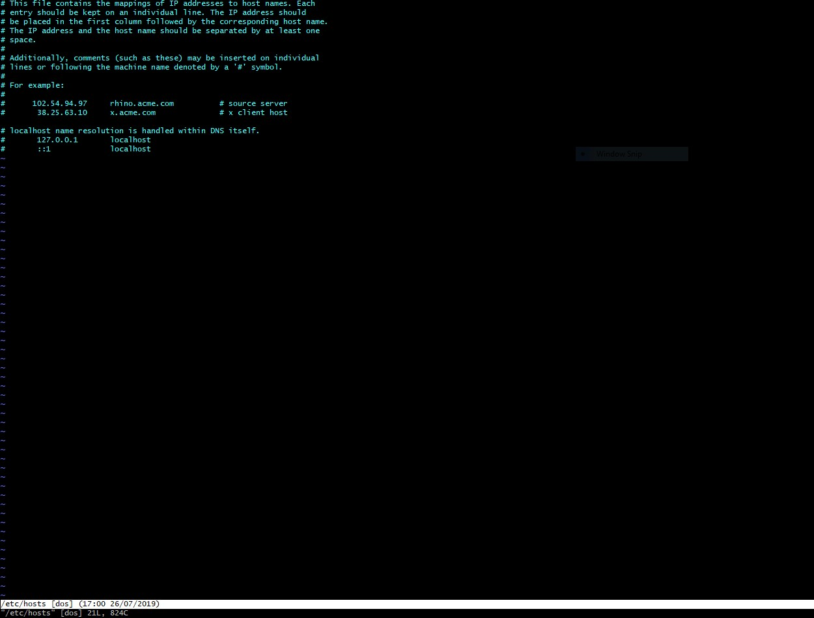
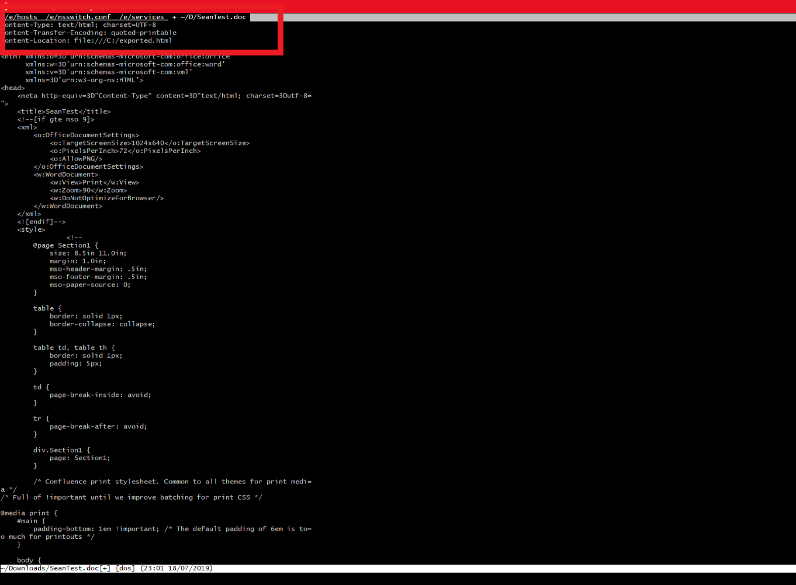
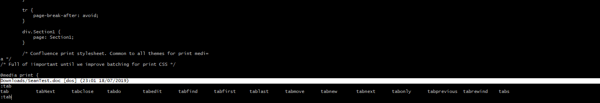

This tutorial will show you how to work with multiple tabs open within one VIM session. If you're not so sure with VIM just yet, then go check out our VIM tutorial on the
Sysadmin learning path here (TODO create sysadmin learning path/VIM)

As a Sysadmin or Developer you will need to work with VIM very often, its a text editor at its core, but capable of so much more. On this site, you will find many VIM tutorials as we believe its one of critical tools you will need to master Linux from the beginning. (Yes we know about Emacs, but don't care about it, get over it) So lets get to it ...

The only things its necessary to understand for now is that VIM has multiple "modes" it can operate it. For the purposes of this tutorial there are two modes we care about,

- "escape mode" - this is not the official name for this mode, but its easy to remember as escape mode, because to access it, you press `ESC` on your keyboard
- "insert mode" - this mode allows you to insert text into your document, there are a few ways to enter insert mode, however for now, we just need to press `i` on your keyboard, while in 'escape mode'.

So remember ... `ESC` and `i`, and keep in mind, when you see any examples below written as `<<filename_here>>`, dont actually put `<<filename_here>>` but replace it with your actual filename you want to use. Unfortunately this is necessary to point out.

First of all open any existing file on your system in VIM, we will use `/etc/hosts` as an example here

`vim /etc/hosts`

VIM is open, and displaying the /etc/hosts file

so lets open some more tabs shall we...

enter escape mode, by pressing `ESC`, then enter the following instruction to VIM,
>  you can press the `TAB` key after typing `:tabedit` to show a file selector

`:tabedit <<filename_here>>`

for example, I will open a document called SeanTest.doc like this,

`:tabedit ./Downloads/SeanTest.doc`

and we can see now there are two tabs open in VIM...

I opened a few more tabs just for fun,

you can repeat this as many times as you like, open all the files!

### Ok cool, So how to work with these tabs?

Heres a quick way to find out your options to work with tabs in VIM ...

go to escape mode, and type
`:tab` .. and then press the `TAB` key on your keyboard, you will see something like this...

So, lets do a quick walkthrough of the most commonly used ones,

- `:tabNext` and `:tabnext` will take you to the next tab
- `:tabprevious` will you take you to the previous tab
-  `:tabs` will show you a list of all open tabs
-  `:tabclose!` will close the current tab

> 
> -  you can also use `g` `t` in escape mode instead of typing `:tabnext`
> - and `g` `T` instead of `:tabprevious`

That's how to work with multiple tabs in VIM, if you have any questions or comments, please feel free to leave them below.

Until next time, **Peace!**
