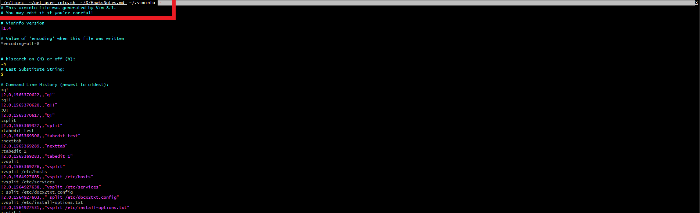
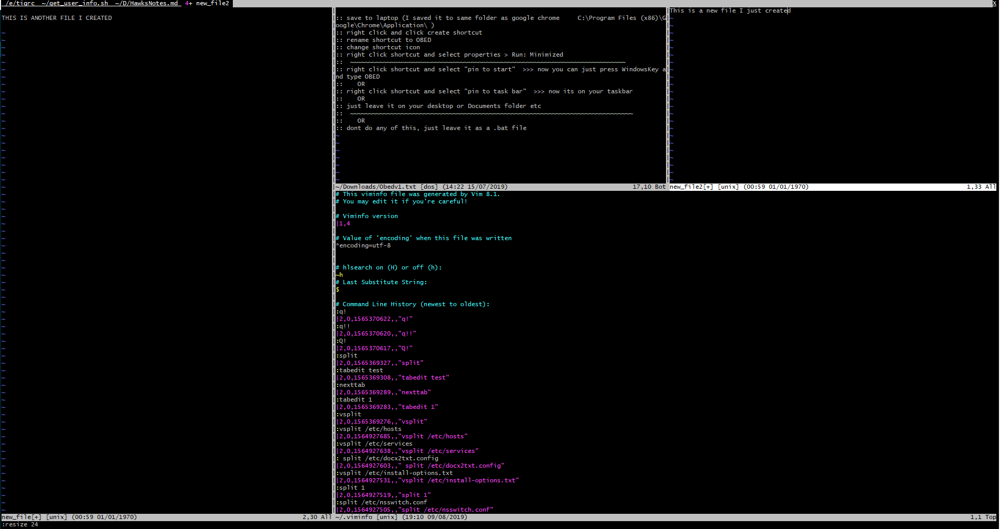
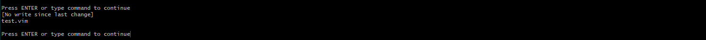

## If you regularly work with the same files and tabs open in Vim, Sessions could be your new best friend

> 📣 For our previous tutorial on how to open multiple tabs in one vim session click [here](https://swhy.netlify.com/how-to-work-with-tabs-in-vim)

Using the powers you gained from the tutorial above, lets go ahead and open a few tabs up in VIM ...



and while we're at it, lets do some vsplits and splits to open split windows in one Vim window..

in Vim "escape mode" type
```
:vsplit <<your_filename_here>>
```

or
```
:split <<your_filename_here>>
```

to open multiple splits, you can switch between these splits using `ctrl` `w` `w` to cycle through them

You can resize them with the following command
```
:resize <<number>>
```

Heres a few I opened for this example,



| 👌 We will create another tutorial further explaining splits in Vim soon!

Now... onto these sessions I promised you...

## Lets **make** a **session**

Now you have all your splits and tabs opened, simply go to "escape mode" by pressing `esc` and type the following ( replace __session_name_here__ with an actual name eg: SeanTest.vim)

```
:mksession ~/.vim/session/session_name_here.vim
```
> 👍 TIP: if the ~/.vim/sessions/  directory doesnt exist, you can create it without leaving VIM! heres how, (in "escape mode")
>```
:!mkdir ~/.vim/sessions/
```
> and then try the mksession command again

now that we have a session created ( you can check it with this command in escape mode)
```
:!ls ~/.vim/sessions/
```
output:


we can close vim, and go have a cup of coffee...we did it!

## Well how to get that session back?

Oh thats easy...
you can do it in one of two ways
- from the command line:
```
vim -S ~/.vim/sessions/session_name_here.vim
```
- from inside vim (in "escape mode")
```
:source ~/.vim/sessions/session_name_here.vim
```

and all your tabs and splits are back! woohoo!


So, now try to think which files it would be good to have in a session...
for example, all configuration files for your system
- ntp.config
- /etc/password
- /etc/groups
- /etc/shadow
- /etc/hosts
- etc etc etc


Today we learned how to open multiple splits and tabs in Vim, how to save these splits and tabs to a session and how to reopen that session at a later time.

If Sean Helped You today, feel free to share this post or connect with us soon, available via [gmail](mailto:seanwillhelpyou@gmail.com), [slack](https://app.slack.com/client/TLMMVFQ1X/CLVTNC1MM) or [github](https://github.com/RH-sdavey/sean-will-help-you).
Thanks for reading!
