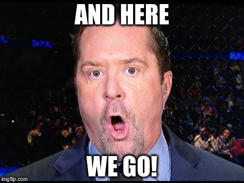
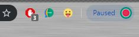
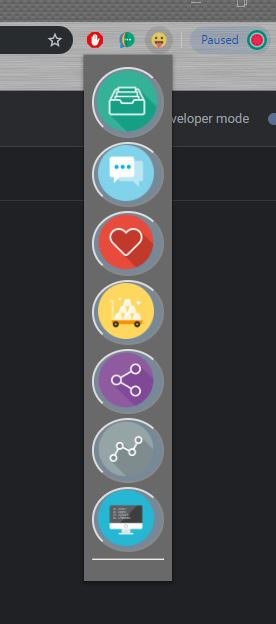
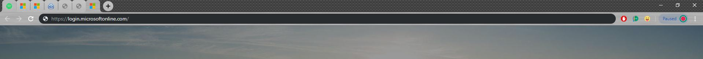
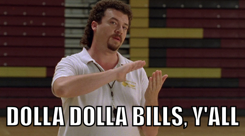

# Google Chrome extensions are awesome, lets make one together!

As we saw in [THIS](https://swhy.netlify.com/windows-create-a-script-to-open-webpages-automatically) previous tutorial,
it's possible to create a script to automatically open up multiple tabs in Google Chrome automatically. Easy right? and
very very useful for your daily work or to bring up your favourite websites quickly.

(Tutorial for how to do this in Linux coming soon...)

BUT... what if we don't need a "script" to do that? a script that is dependent on which OS we run it on. What if...
we can create an extension for Google Chrome, that will run on any Operating System...




Lets create a Chrome extension that will open all our favourite websites at the push of a button...

To make our extension we need 3 files, this "could" be cut down to 2... but to keep everything clear lets stay with 3. Create 3 files in any folder on your system... "Documents/sean-extension" for me.

- manifest.json
- popup.html
- popup.js

#### manifest.json
This is the file that allows our extension to be loaded by Google Chrome, if the below info is not correct our extension wont load, simple.
```json
{
    "manifest_version": 2,

    "name": "extension name here",  
    "description": "extension description here",
    "version": "1.0",
    "author": "Sean",

    "browser_action": {
        "default_icon": "icon.png",
        "icons": "icon.png",
        "default_popup": "popup.html"
    },
    "permissions": [
        "tabs",
    ],

    }
}
```
- manifest_version    -> keep it as 2 for now
- name  ->  put your extension name there
- description  -> put your extension description there
- version  -> keep it as "1.0"
- author -> put your name there
- default_icon  -> ah, you will need 4 files, sorry! find or create a png file that will be the icon for your extension, and it must be exactly 24x24 px Here's mine..  you can just take that if you wish,( right click and press save pictures as, and save it to the same folder) . It looks like this in Chrome..

- icons -> same as "default_icon"
- default_popup -> this is the "window" that will appear when we click on the extension button
- permissions/tabs -> this is the permission that will allow our extension to open new tabs

#### popup.html

This is the file that creates the window that is loaded when we press the button for our extension in Chrome.

```html
<!doctype html>
<html>
<head>
    <title>SeanHelper</title>
    <style>
        body {
          background-color: dimgrey;
          background-size: 110%;
          background-repeat: no-repeat; }      
        button {
          background-color: lightslategray;
          border-radius: 100%;
          size: 1em; }
    </style>
    <script src="popup.js"></script>
</head>
<body>
    <button id="daily"></button>
</body>
</html>
```

I wont explain the whole code to you there, but two most important lines are...
```html
<script src="popup.js"></script>
```
and
```html
<button id="daily"></button>
```
The first line will source a script called `popup.js`, (that's the next part...)

and the second line creates a button in our extension with an id of "daily"  ( as in the daily webpages we visit, daily )

last file...

#### popup.js

```javascript
document.addEventListener('DOMContentLoaded', function() {
    var checkPageButton = document.getElementById('daily');
    checkPageButton.addEventListener('click', function() {

        chrome.tabs.create({
            url: "https://open.spotify.com/browse/featured#_=_"
        })
        chrome.tabs.create({
            url: "https://outlook.office365.com/mail/inbox/"
        })
        chrome.tabs.create({
            url: "https://outlook.office365.com/calendar/view/month"
        })
        chrome.tabs.create({
            url: "https://reddit.com/r/reddevils/"
        })
        chrome.tabs.create({
            url: "https://google.com"
        })
    }, false);
}, false);
```

again, I wont explain everything here... but most important parts are,
```javascript
document.getElementById('daily')
```
and each one of these...
```
chrome.tabs.create({
           url: "website_address_here"
       })
```

The 'daily' line is creating an `addEventListener` on our "daily" button that we created in `popup.html`, so that every time its clicked, it will do something...

##### What will it do?

well the clue is here... `chrome.tabs.create`

you can put as many of these sections with addresses to open as you wish, every time you press the button it will open ALL of them!

📌 Why not think about how to create multiple buttons that open different tabs depending on which ones pressed?

##### Ok, I've got the 3 files... how can I get them "into" Chrome?

Super easy...
 1. Open Chrome
 1. In the url, address bar, type "chrome://extensions"
 1. In the top-right of the screen, enable "Developer mode"
 1. Click "Load unpacked"
 1. Select the folder where your 4 files are, and press "Select Folder"  (if your extension doesn't load, there is something wrong with your manifest file, or your icon.png is the wrong size, this happened to me, so check the tutorial from the beginning)
 1. Enjoy your extension


 I went a little further with mine and added a few more buttons to open different website when clicked. Here's what it looks like....

 

 - The first button opens up all my daily tabs I use for work each day
 - The second opens up all my social media and chat applications etc
 - Third link takes me to all Man Utd forums (GGMU!)
 - Fourth link takes me to my banking apps
 - 5th link takes me to all sites I need to build this site, swhy!
 - Sixth and Seventh links open up pages that I periodically need to do my work ( I kept them separate from my daily tabs)

##### so lets press the first link...

ok, here we go....



all the websites I need for my daily work opened in ~1sec by pressing a button...


###### Cool, but your tabs are small!

Yeah, one last tip and them I'm outta here...

remember this part of `popup.json`?
```
chrome.tabs.create({
           url: "website_address_here"
       })
```

you can change it to...
```
chrome.tabs.create({
           pinned: "true",
           url: "website_address_here"
       })
```

and your tabs will open as pinned tabs. Easy

There's a few more cool things you can do to change the behaviour of opened tabs described in the Chrome documentation [HERE](https://developer.chrome.com/extensions/tabs)

Today we learned how to make a chrome extension to open your favourite websites automatically at the press of a button.


If Sean Helped You today, feel free to share this post or connect with us soon, available via [gmail](mailto:seanwillhelpyou@gmail.com), [slack](https://app.slack.com/client/TLMMVFQ1X/CLVTNC1MM) or [github](https://github.com/RH-sdavey/sean-will-help-you).
Thanks for reading!
