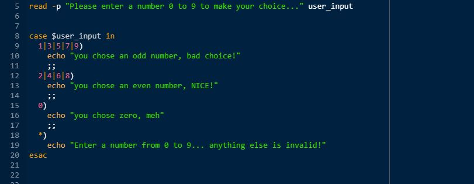
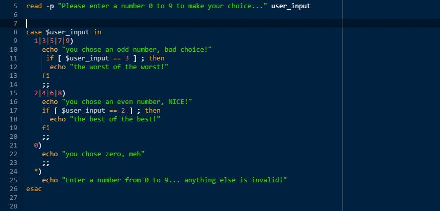
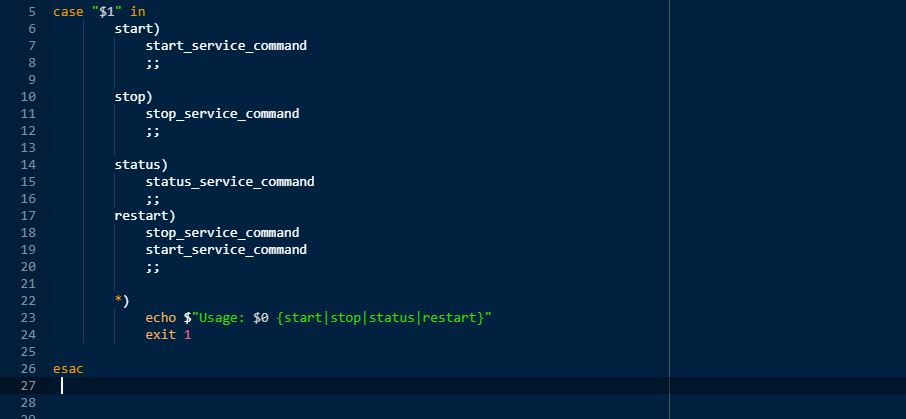

Nested `if` statements (that is, `if`s within `if`s) are cool and all, and will usually do the job nicely, but if your list of `if`s for all possible outcomes gets bigger and bigger, then the code become unreadable quite quickly... case statements to the rescue!

`case` is an incredibly useful tool in your scripting arsenal, but so many sysadmins and bash developers don't use it to its full potential. Lets break it down here, and walk through a few of its uses to clear up some confusion,

```bash
case EXPRESSION in
    CASE1)
        COMMAND1
        COMMAND2
        ;;
    CASE2)
        COMMAND3
        ;;
    CASE3)
        COMMAND4
        COMMAND5
        COMMAND6
        ;;
    CASE4|CASE5)
        exit
        ;;
    *)
        OTHER COMMANDS HERE
        ;;
esac
```

## What does all that mean?

Lets break it down...  (and dont worry if you dont get it at first look, all will become clearer further down)

- `case EXPRESSION in` 
  - `case` is the command we are using ( the one we are learning about right now )
  - `EXPRESSION` is the thing we want to test, it could be a string, a number, an input (eg: $1)
  - `in` is a keyword for the case command to check if EXPRESSION is "in" the below list

- `CASE1)`
  - the first "case" that our expression could be, if `EXPRESSION` matches `CASE1` it will execute `COMMAND1` and `COMMAND2` below

- `;;` this symbol will tell `case` that it has finished executing the correct `COMMANDS` for this `CASE` and will now exit the `case` statement altogether. It's a very common mistake to forget to put `;;` at the end of each `CASE` and can case some seriously unwanted code to execute so remember to put it there!

so nothing matched for `CASE1`, what now?

well case will continue down the list of cases... so, onto the next `CASE!`

- `CASE2`)
  - Because no match was made for `CASE1` then `case` will **_not_** execute any of the commands inside the `CASE1` block, and will continue down the list to `CASE2` looking for another match...
  - If it finds a match in `CASE2` then it will execute `COMMAND3` inside that block...
  - if _still_ no match is found, `case` will continue looking further and further down the list until it finds a match

### What if it never finds a match?

Great question!  thats where this line does its job...

-  `*)
        OTHER COMMANDS HERE
        ;;`

   - The `*` symbol here is considered as a "catch-all", that is to say if `CASE` matched our `EXPRESSION` then `*` will catch it, and any commands within the `*` block will execute. So we know every possible input will be caught somehow. `*` can be used to catch invalid input and return an error message to the user to wise-up ...

and ....

- `esac` ends the `case` statement, (its `case` backwards, geddit?), again its a common gotcha to forget to end with `esac` and it **will** make you crazy trying to figure out whats going wrong, so don't forget it!

### Ok, got it.... still completely confused!

No problem my furry little friend..  a picture is worth a 1000 words... so lets look at 3000 words to see some examples of what we learned here...



#### Quick explanation...
- on Line 5, im using the `read` command (another command for another tutorial TODO(make `read` tutorial)  to get the user to input a number from 0 to 9, and save that input into a variable called "user_input"
- on Line 7 my `case` statement begins, and `user_input` is my `EXPRESSION` I am checking the value of.
- if `user_input` is either 1  (this symbol --> |   means "or" here) or 3 or 5  or 7 or 9 then execute the code in this block...
  - echo to the screen our distaste of odd numbers.
  - then `;;` will exit the `case` command altogether, no further checks will be made on `user_input`
- if no odd number was entered then the first `CASE` (odd numbers) will be skipped and `case` will continue down the list...
- The next block is checking if `user_input` is 2 or 4 or 6 or 8.  If it is on of these, the code below will execute,
  - echo to the screen our love of even numbers
  - `;;` will exit the case command altogether
- The same logic continues that if `user_input` is 0 (zero) then the code below that `CASE` below is executed (no strong feelings about zero)
- if the user entered the number "38489235" or "10" or "eggs" then it will be caught by `*` and the user will be informed they made a mistake with their input and the `case` statement will end, the user could then taken back to the beginning where they again have the option to enter a valid number.


#### Choices within choices, Options within options....



The code is basically the same as above, just with two minor changes...
we can also embed `if` statements within `case` statements, to add more functionality to our checks and outputs...

- Above we can see if the user enters for `user_input` the value of "4" then the following code will execute
  - `echo "you chose an even number, NICE!"`
  - then there will be a check to see if `user_input` is equal to 2. Obviously 4 is not equal to 2, so this will not be true, and the `if` statement ends, as does the `case` statement, and we carry on with our lives...

- However if the user does enter "2" as `user_input` then this is the output of our script....


beautiful...

> 👍 Try to go ahead now and think how you can use `case` statements inside `case` statements, to really fine-tune your `EXPRESSION` matching

#### Finally a practical example,

Have a look at this and think how it could help you automate some of your daily work as a sysadmin,
all I will explain is that "$1" is a bash standard shortcut for the "first value given after the script name..." so in this example..

```bash
my_terminal_prompt:> ./my_awesome_script.sh sean will help you
```
- "my_awesome_script.sh"  = "$0" (the actual script)
- "sean" = "$1" (the first parameter)
- "will" = "$2" (the second parameter etc etc)
- "help" = "$3"
- "you" = "$4"

and in this example
```bash
systemctl status ntp
```
- status = $1

so, keeping that in mind, have a look below...



Now go and play my (script) kiddies! Have a great day!

If Sean Helped You today, feel free to share this post or connect with us soon, available via [gmail](mailto:seanwillhelpyou@gmail.com), [slack](https://app.slack.com/client/TLMMVFQ1X/CLVTNC1MM) or [github](https://github.com/RH-sdavey/sean-will-help-you).
Thanks for reading!
