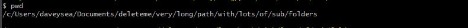
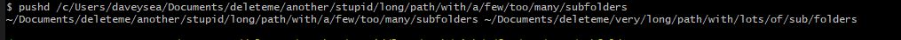
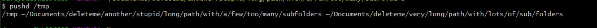
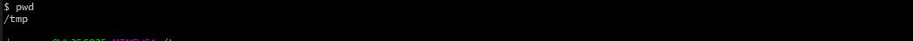
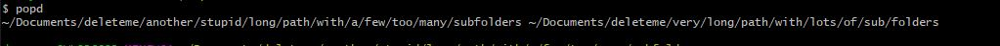
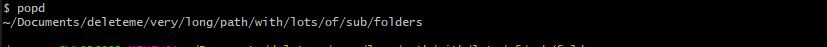
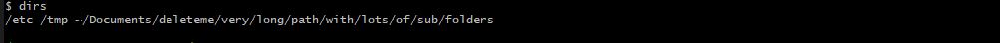

#### Quick tutorial today to show the usage of pushd and popd commands for your Bash scripts, Lets get started!

Quite often when creating, and then running, Bash scripts you will need to generate temporary (tmp) files, or to deposit files in different directories around the system, as a way to run your scripts correctly in future. This can get quite messy quickly if you dont keep control over it. Furthermore, when zooming around the filesystem during your daily work, you might face the scenario where you need to go from,
- /this/incredibly/long/path/with/lots/of/sub/folders....  to...
- /tmp .... and then back to,
- /this/incredibly/long/path/with/lots/of/sub/folders

well that can be really easily done with,

```bash
cd /tmp               <-- will take you to /tmp dir
cd -                  <-- will take you back to where you were before /tmp
```

#### But what about this scenario...?
- /this/incredibly/long/path/with/lots/of/sub/folders....  to...
- /another/incredibly/long/path/with/lots/of/sub/folders....  to...
- /tmp .... then back to, 
- /another/incredibly/long/path/with/lots/of/sub/folders.... and then to...
- /this/incredibly/long/path/with/lots/of/sub/folders

`cd -` wont really cut the mustard here...

### PUSHD !

Ok, so I'm  in a directory on my laptop, with a very long path... lots of subfolders here, 



lets use `pushd` to skip to another directory with a lot of subdirs...



ok so now, we're in another directory, lets jump over to `/tmp` using `pushd`



#### Ok, cool, whats the point of all this then?

Well, by using `pushd` we're creating a "stack" of places around the filesystem, that is added to everytime we use the `pushd` command ( we are "pushing" a *__d__*irectory) onto the stack.) Think of them as markers around the system that work like a "trail" to go back along.

#### So how to go back through this trail ... the "stack" ?

### POPD!

So Im at the end of my trail here... in `/tmp`



lets use `popd` to go back to our previous point `/c/Users/daveysea/Documents/deleteme/another/stupid/long/path/with/a/few/too/many/subfolders`

its as simple as...



then let's go back to our very first folder...



#### So what did we do there...?

We used `pushd` to move around various directories in the filesystem, leaving "markers" in each place along our trail. These markers make up a "stack" to which we can keep adding to, or traverse backwards along.

#### Ok, why is it useful?

As mentioned at the opening, sometimes when running a complicated script that needs a runtime configuration setting, you may need to create a tmp file in `/tmp` folder, then go to `/var` folder to set some variables etc etc... and to any other place in the system to make our script work properly... well, `pushd` and `popd` will take all the memory worries about where you , where you need to be etc. 

More automation = less thinking = less mistakes!

> 👍 Little tip:  As you can see from the outputs above there is some output from each time you use `pushd` and `popd`, the output is basically "the stack" being represented to us everytime we push and pop to it. When we want to use `pushd` and `popd` as part of a script, that ideally would have nice, neat, clean ouput without too much disturbance to the user, it would be good to get rid of this output. This can be done with ....   pushd /folder/to/add/to/the/stack  `2>/dev/null` ... and ... popd `2>/dev/null`

#### One last thing...

`dirs` command will output "the stack" to the screen so we can see where each of our markers are, and in what order...



Have a great day playing with `pushd` and `popd` !!

If Sean Helped You today, feel free to share this post or connect with us soon, available via [gmail](mailto:seanwillhelpyou@gmail.com), [slack](https://app.slack.com/client/TLMMVFQ1X/CLVTNC1MM) or [github](https://github.com/RH-sdavey/sean-will-help-you).
Thanks for reading!
